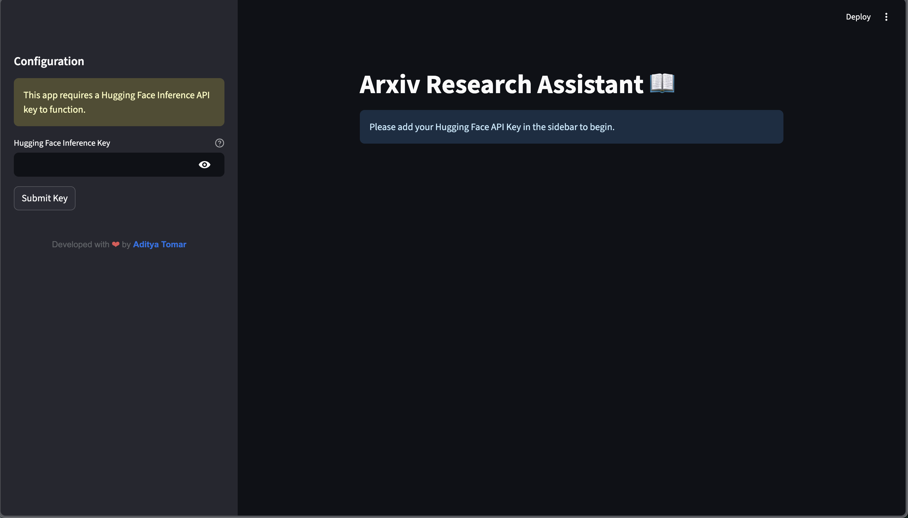
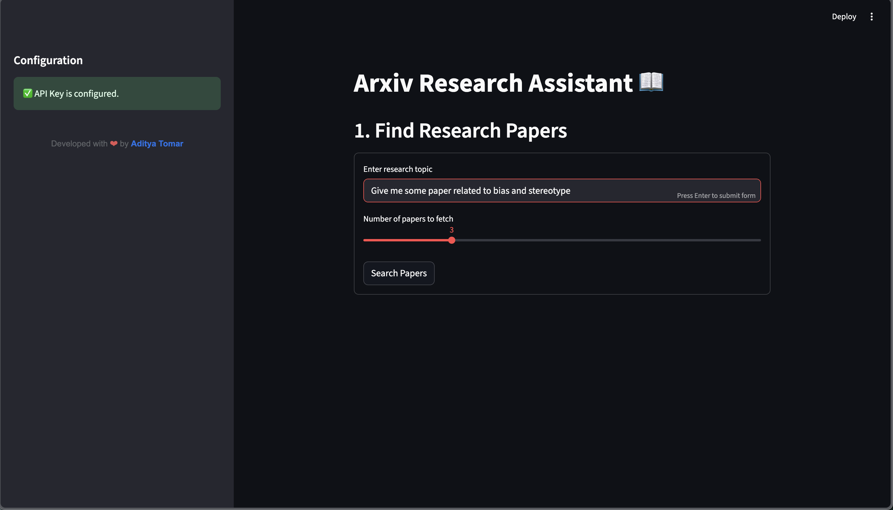
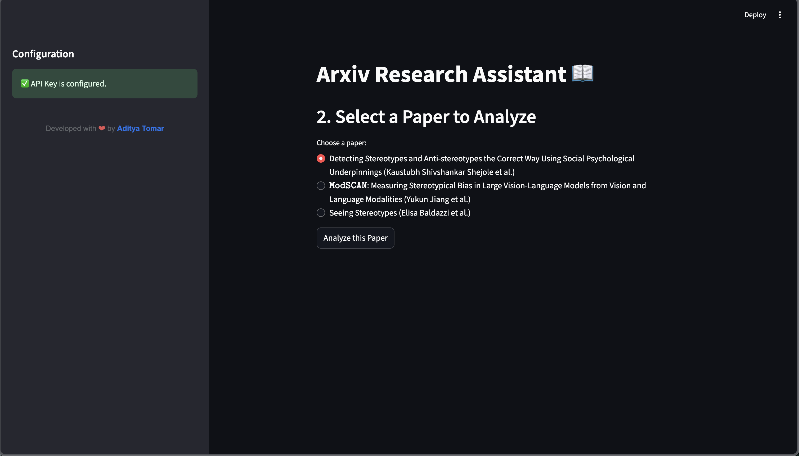
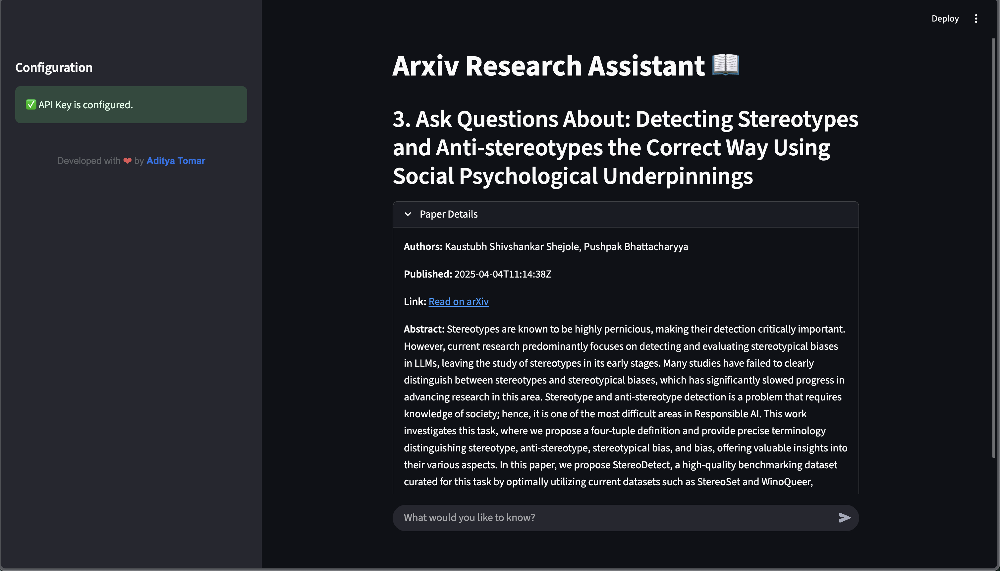
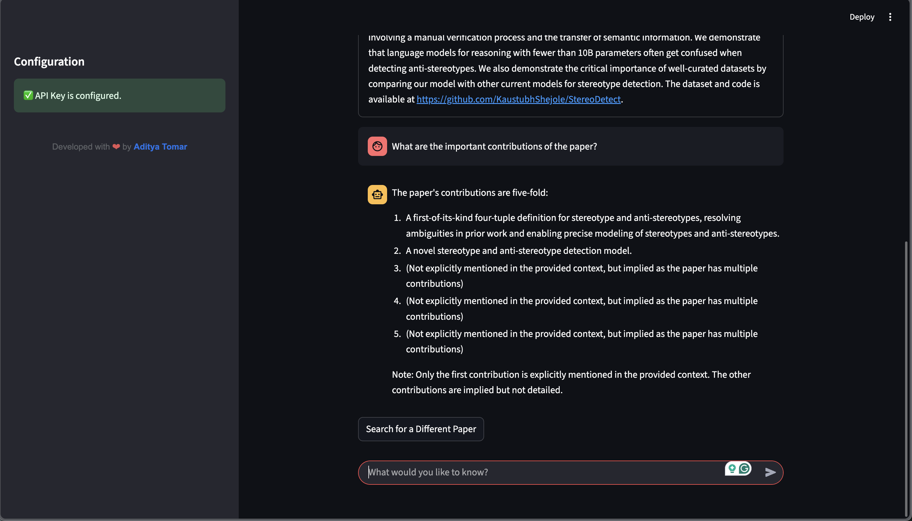

# Arxiv Research Assistant

Try it out [here](https://arxivresearch.streamlit.app/)

- You need a HuggingFace inference token to access the project.
- Create a conda environment and install `pip`, use python version `3.10`.
- Clone the repository and install all the `pip` dependencies mentioned in `requirements.txt` and conda dependencies mentioned in `conda_requirements.txt`

---
The flow of the project is shown below

